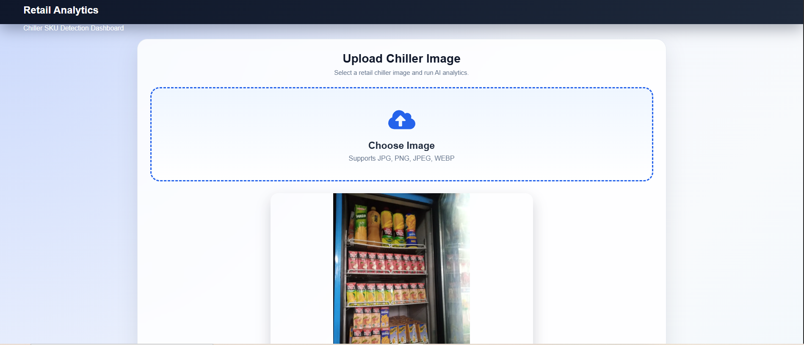
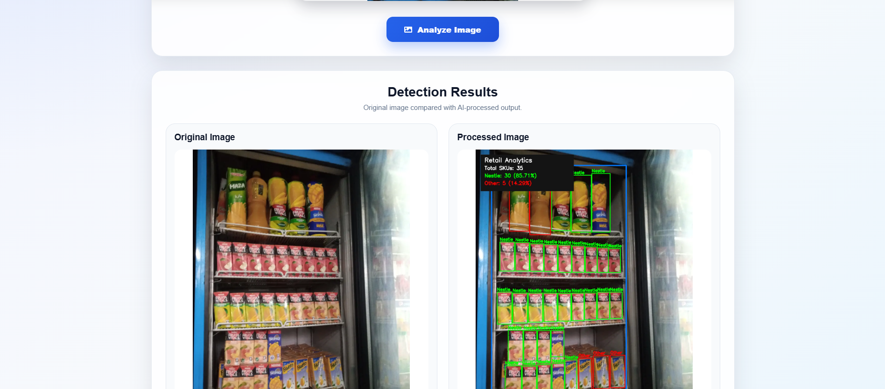
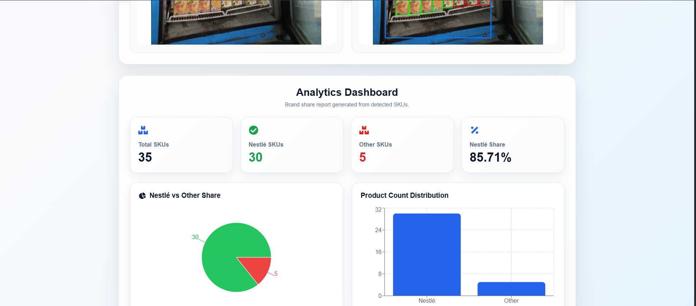

# Retail Analytics Dashboard

AI-based retail chiller analytics system for detecting chiller areas, identifying total SKU products, detecting Nestlé SKUs, and generating a Nestlé vs Other Brands analytics report.

The system is designed to analyze retail chiller images and calculate the product share of Nestlé products compared with other visible SKU products inside the chiller.

---

## System Screenshots

### System UI









---

## Project Overview

This project analyzes retail chiller images using computer vision and deep learning models.

The system follows this production pipeline:

```text
Chiller Detection Model
        ↓
Crop Valid Chiller Area
        ↓
General SKU Detection Model
        ↓
Nestlé SKU Detection Model
        ↓
Nestlé vs Other SKU Report
